# YOLOv8 环境安装

> 注：在安装软件过程中，若无特殊说明，则保持软件默认安装选项，无需进行修改

## 1.1 安装python

[https://www.python.org/](https://www.python.org/)

安装时，建议勾上`Add python.exe to PATH`选项，之后就无须单独配置`PATH`了


## 1.2 环境验证

在cmd中输入`python --version`（或者`python -V`），看终端是否显示对应版本，若显示则安装成功，否则检查安装步骤

```bash
$ python --version
Python 3.10.10
```

## 2.1 安装Anaconda

[https://www.anaconda.com/](https://www.anaconda.com/)

为了避免与其他软件发生冲突，这里不建议勾选`Add Anaconda3 to my PATH environment variable`选项，保持默认即可

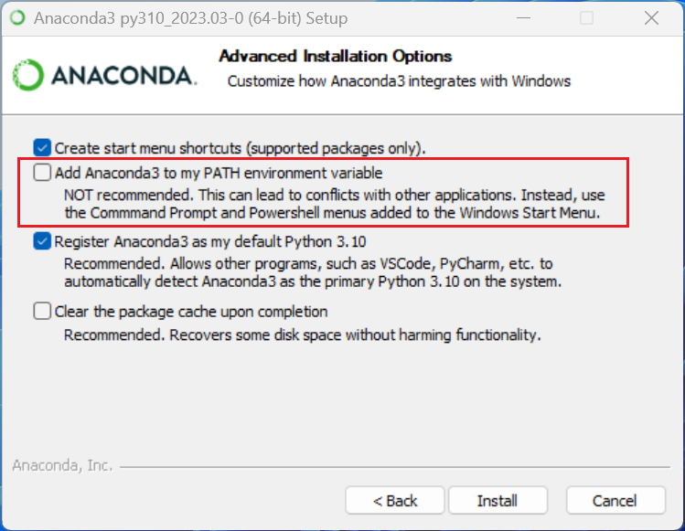

## 2.2 环境验证

在搜索框中输入`anaconda`，如果出现`Anaconda Prompt`和`Anaconda Navigator`说明安装成功。

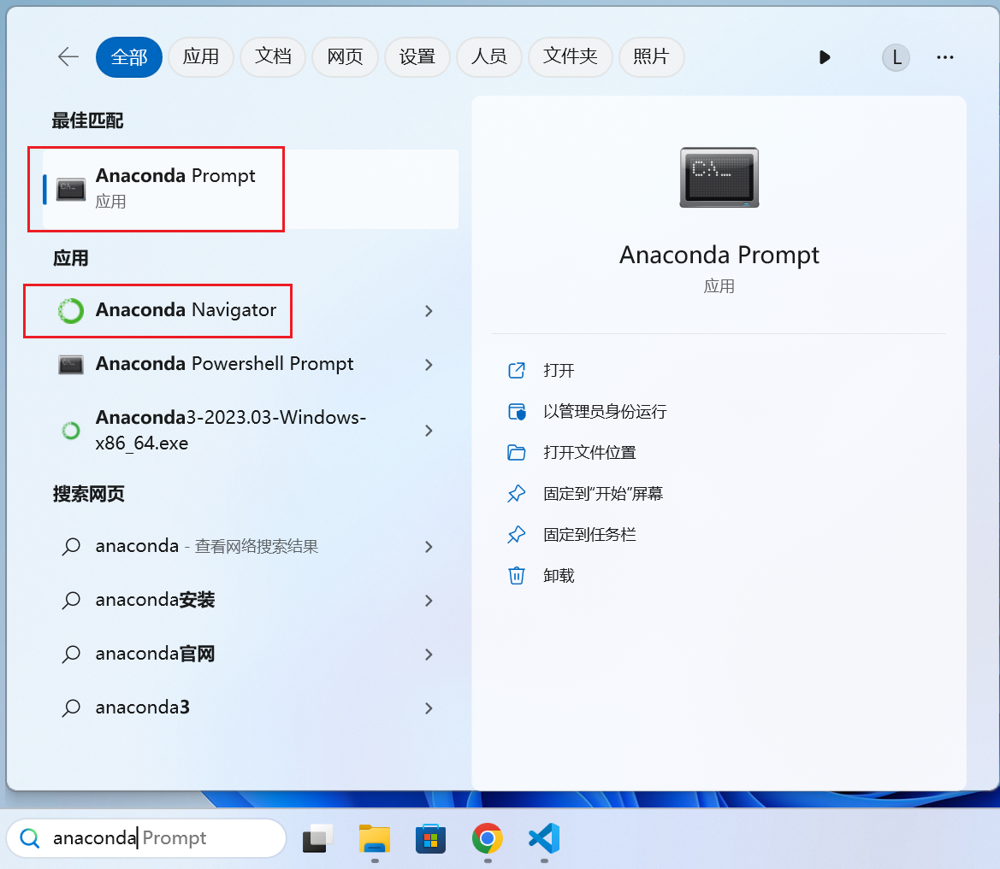

## 3.1 安装Git

[https://git-scm.com/](https://git-scm.com/)

## 3.2 环境验证

在cmd中输入`git --version`，看终端是否显示对应版本，若显示则安装成功。

```bash
$ git --version
git version 2.40.0.windows.1
```

## 4.1 安装GPU Driver

在Windows中可以通过右键单击`win`图标的方式打开设备管理器，打开后，找到显示适配器选项，查看自己的GPU，例如本机中的GPU为`NVIDIA GeForce RTX 3050 Laptop GPU`。

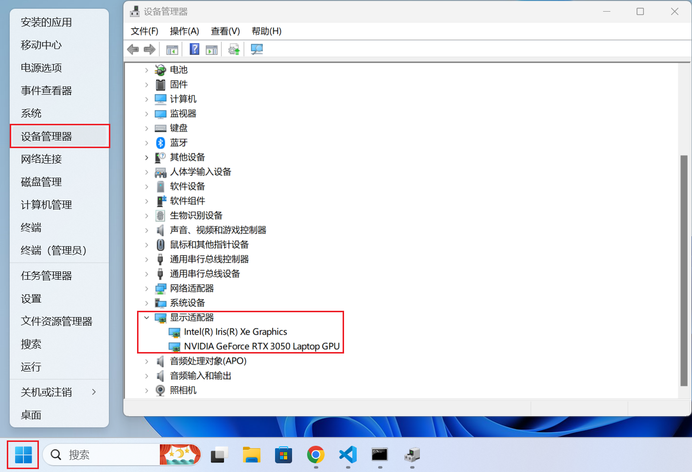

[https://www.nvidia.com/download/index.aspx](https://www.nvidia.com/download/index.aspx)

之后在nvidia网站中选择自己对应的版本进行下载安装。  
例如在本机中，对应的配置如图。

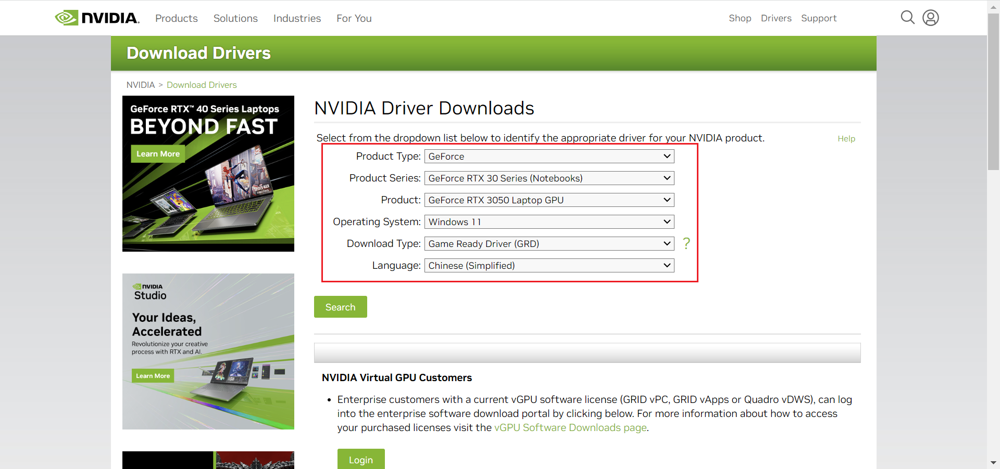

安装过程中可能会出现屏幕闪烁，属于正常现象，不必担心。

## 4.2 环境验证

在cmd中输入`nvidia-smi`，看终端显示类似信息，说明安装成功。

```bash
$ nvidia-smi
Mon Mar 27 09:14:29 2023
+---------------------------------------------------------------------------------------+
| NVIDIA-SMI 531.41                 Driver Version: 531.41       CUDA Version: 12.1     |
|-----------------------------------------+----------------------+----------------------+
| GPU  Name                      TCC/WDDM | Bus-Id        Disp.A | Volatile Uncorr. ECC |
| Fan  Temp  Perf            Pwr:Usage/Cap|         Memory-Usage | GPU-Util  Compute M. |
|                                         |                      |               MIG M. |
|=========================================+======================+======================|
|   0  NVIDIA GeForce RTX 3050 L...  WDDM | 00000000:01:00.0 Off |                  N/A |
| N/A   51C    P8                9W /  N/A|    160MiB /  4096MiB |      0%      Default |
|                                         |                      |                  N/A |
+-----------------------------------------+----------------------+----------------------+

+---------------------------------------------------------------------------------------+
| Processes:                                                                            |
|  GPU   GI   CI        PID   Type   Process name                            GPU Memory |
|        ID   ID                                                             Usage      |
|=======================================================================================|
|    0   N/A  N/A     20880    C+G   ...9\extracted\runtime\WeChatAppEx.exe    N/A      |
|    0   N/A  N/A     24608    C+G   C:\Windows\explorer.exe                   N/A      |
+---------------------------------------------------------------------------------------+
```

在`CUDA Version`中，还给出了支持的CUDA版本，下一步，我们根据这个版本安装CUDA，本机中为`12.1`

## 5.1 安装CUDA

[https://developer.nvidia.com/cuda-toolkit-archive](https://developer.nvidia.com/cuda-toolkit-archive)

官方提供两种安装方式：网络安装和本地安装。建议采用本地安装方式。

## 5.2 环境验证

在cmd中输入`nvcc --version`，看终端是否显示对应版本，若显示则安装成功。

```bash
$ nvcc --version
nvcc: NVIDIA (R) Cuda compiler driver
Copyright (c) 2005-2023 NVIDIA Corporation
Built on Wed_Feb__8_05:53:42_Coordinated_Universal_Time_2023
Cuda compilation tools, release 12.1, V12.1.66
Build cuda_12.1.r12.1/compiler.32415258_0
```

## 6.1 安装CuDNN

[https://developer.nvidia.com/cudnn-download-survey](https://developer.nvidia.com/cudnn-download-survey)

需要登录NVIDIA的账户，没有账户的小伙伴可以直接注册一个再继续登录。
下载完成后，解压压缩包，目录结构如下:

```bash
cudnn-windows-x86_64-8.8.0.121_cuda12-archive
├─bin
├─include
└─lib
    └─x64
```

1. 将`bin`目录下所有的`dll`文件复制到`C:\Program Files\NVIDIA GPU Computing Toolkit\CUDA\v12.1\bin`目录中。
2. 将`include`目录下所有的`.h`文件复制到`C:\Program Files\NVIDIA GPU Computing Toolkit\CUDA\v12.1\include`目录中。
3. 将`lib\x64`目录下所有的`.lib`文件复制到`C:\Program Files\NVIDIA GPU Computing Toolkit\CUDA\v12.1\lib\x64`目录中。

> 注：上述目录根据你的设备自行调整

## 6.2 安装zlib

[https://docs.nvidia.com/deeplearning/cudnn/install-guide/](https://docs.nvidia.com/deeplearning/cudnn/install-guide/)

选择`Installing cuDNN on Windows`中的`Installing Zlib`，下载`ZLIB DLL`。

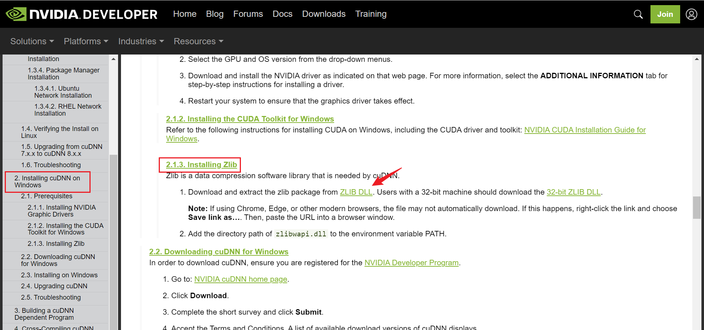

解压下载后的文件，得到如下目录。

```bash
zlib
├─dll_x64
│  └─demo
└─static_x64
```

将`dll_x64`添加到环境`PATH`。

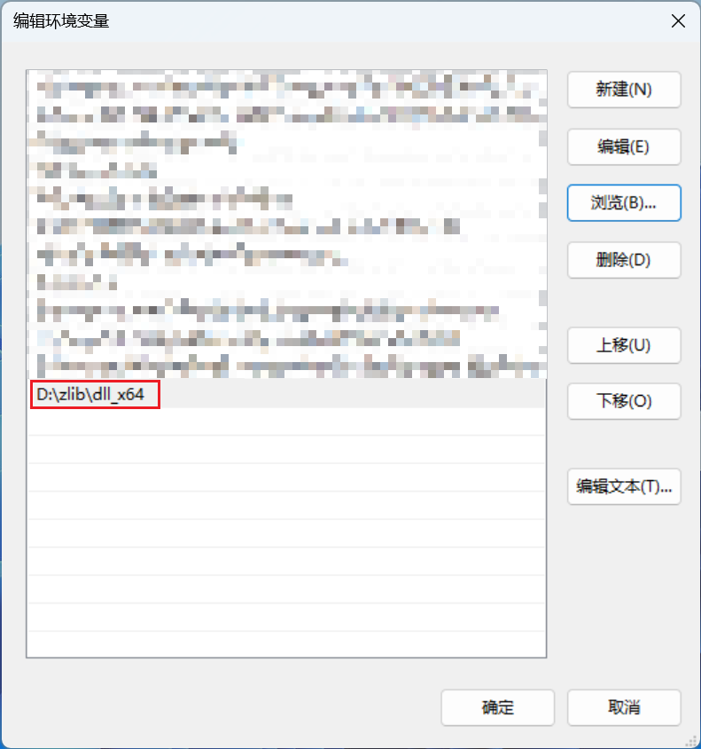

## 7.1 安装YOLOv8 GPU Mode

选择`Environments`，点击`Create`，为环境命名，并选择python版本后选择`Create`

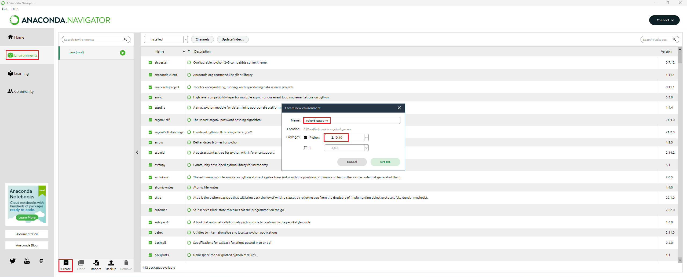

等待环境创建完毕
打开`Anaconda Prompt`，使用activate命令激活环境。显示如下结果，说明激活成功。

```bash
(base) C:\Users\liu-i>activate yolov8-gpu-env

(yolov8-gpu-env) C:\Users\liu-i>
```

选择你要安装的目录，新建文件夹，可以通过命令建立。

```bash
(yolov8-gpu-env) C:\Users\liu-i>d:

(yolov8-gpu-env) D:\>mkdir yolov8-gpu

(yolov8-gpu-env) D:\>cd yolov8-gpu

(yolov8-gpu-env) D:\yolov8-gpu>
```

之后将在该目录中安装pytorch

## 7.2 安装pytorch

[https://pytorch.org/](https://pytorch.org/)

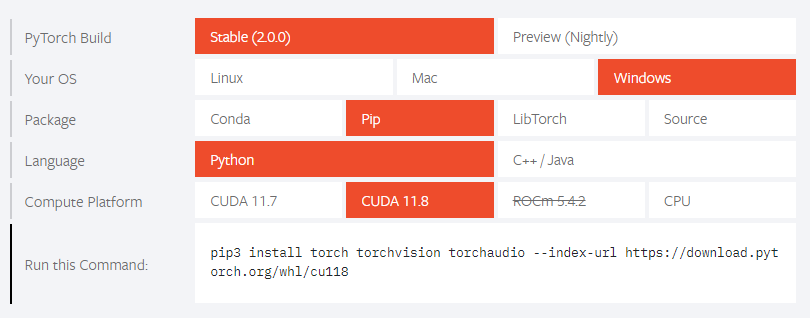

选择对应版本并复制Command，粘贴到Anaconda Prompt中进行安装。

```bash
(yolov8-gpu-env) D:\yolov8-gpu>pip3 install torch torchvision torchaudio --index-url https://download.pytorch.org/whl/cu118
```

## 7.3 安装tensorboard

```bash
(yolov8-gpu-env) D:\yolov8-gpu>pip install tensorboard
```

## 7.4 安装并测试YOLOv8

根据[https://github.com/ultralytics/ultralytics](https://github.com/ultralytics/ultralytics)的`README.md`

1. 安装`ultralytics`

    ```bash
    (yolov8-gpu-env) D:\yolov8-gpu>pip install ultralytics
    ```

2. 下载模型，这里以YOLOv8n为例
    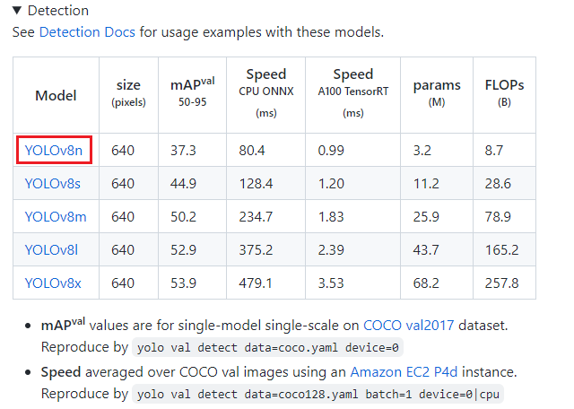
3. 运行模型（Command Line Interface Mode）

    ```bash
    (yolov8-gpu-env) D:\yolov8-gpu>yolo predict model=yolov8n.pt source='https://ultralytics.com/images/bus.jpg' save=True
    ```

    这里采用`save=True`选项以保存结果
    运行结果如下：

    ```bash
    (yolov8-gpu-env) D:\yolov8-gpu>yolo predict model=yolov8n.pt source='https://ultralytics.com/images/bus.jpg' save=True
    Ultralytics YOLOv8.0.58  Python-3.10.10 torch-2.0.0+cu118 CUDA:0 (NVIDIA GeForce RTX 3050 Laptop GPU, 4096MiB)
    YOLOv8n summary (fused): 168 layers, 3151904 parameters, 0 gradients, 8.7 GFLOPs

    Downloading https://ultralytics.com/images/bus.jpg to bus.jpg...
    100%|█████████████████████████████████████████████████████████████████████████████| 476k/476k [00:00<00:00, 595kB/s]
    image 1/1 D:\yolov8-gpu\bus.jpg: 640x480 4 persons, 1 bus, 1 stop sign, 78.6ms
    Speed: 0.0ms preprocess, 78.6ms inference, 44.8ms postprocess per image at shape (1, 3, 640, 640)
    Results saved to runs\detect\predict
    ```

    运行后目录结构如下：

    ```bash
    yolov8-gpu
     └─runs
         └─detect
             └─predict
    ```

    检测前后图片如下：

    

    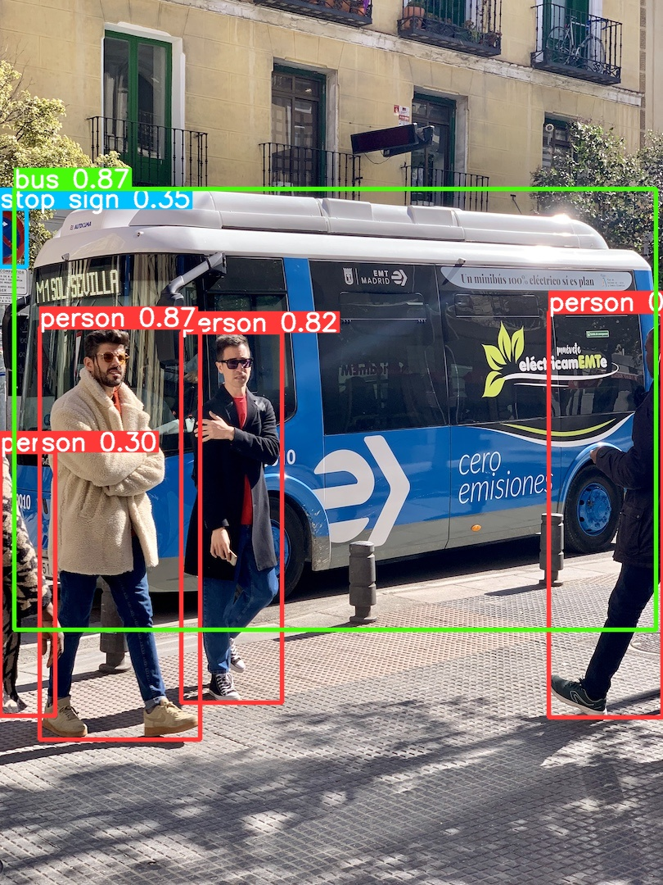

## 7.5 训练模型

本节，以口罩检测为例（提供训练数据下载的[链接](https://www.dropbox.com/s/3u9yg3yk7xz54i1/face_mask_dataset.zip?dl=0)），采用Command Line Interface(CLI)进行模型的训练演示，只提供相关的命令以及运行过程，相关参数不予讲解。详细信息请查看[https://docs.ultralytics.com/](https://docs.ultralytics.com/)，里面有详细的介绍。

对上述模型进行训练。

```bash
yolo detect train model=yolov8n.pt data=data\face_mask.yaml imgsz=640 workers=0 batch=2 device=0 epochs=300 patience=50 name=yolov8_face_mask
```

训练的过程如图所示：

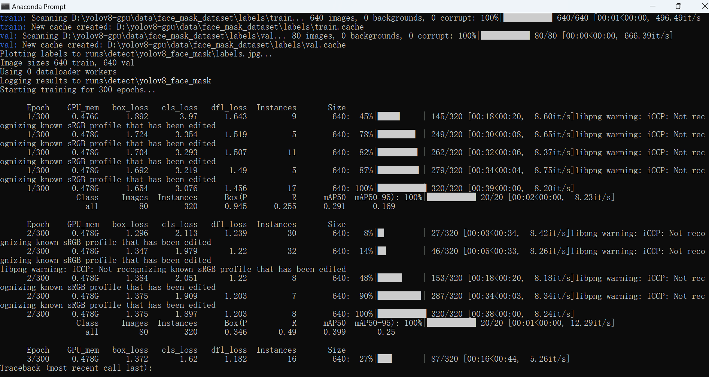

使用`Ctrl + C`可以终止运行。

在`.\runs\detect\yolov8_face_mask`目录中可以看到训练的过程、一些参量以及训练的模型（在`.\weights`中）。

## 7.6 利用tensorboard可视化工具进行分析

```bash
tensorboard --logdir runs\detect\yolov8_face_mask
```

```bash
(yolov8-gpu-env) D:\yolov8-gpu>tensorboard --logdir runs\detect\yolov8_face_mask
TensorFlow installation not found - running with reduced feature set.
Serving TensorBoard on localhost; to expose to the network, use a proxy or pass --bind_all
TensorBoard 2.12.0 at http://localhost:6006/ (Press CTRL+C to quit)
```

在浏览器中访问:<http://localhost:6006/>

由于我只迭代了两次，结果如下：

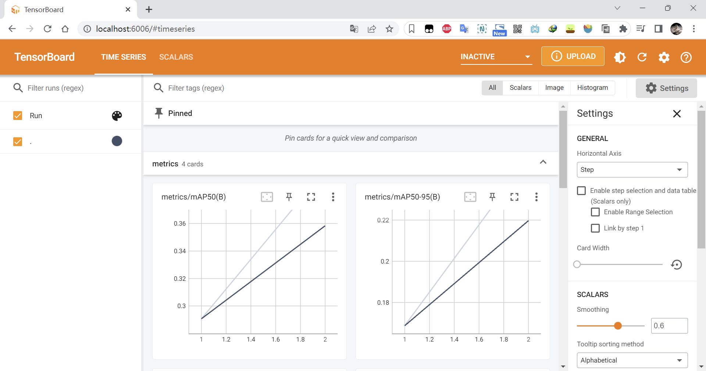

## 7.7 继续未完成的训练

```bash
yolo detect train model=runs\detect\yolov8_face_mask\weights\last.pt data=data\face_mask.yaml resume=True
```

可以看到，训练从第3次开始继续迭代。

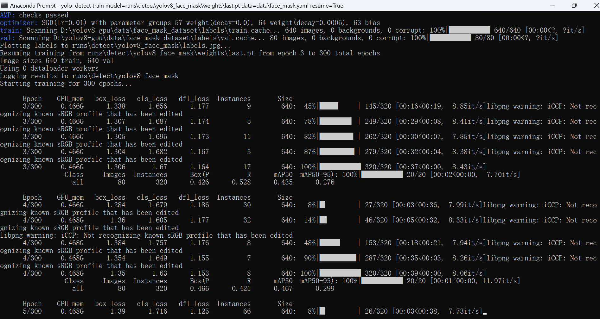
